# INSTITUT UNIVERSITAIRE DES SCIENCES (IUS)
## Faculté des sciences et des technologies (FST)

---

# PROJET DE RÉSEAU II
### Niveau : L3

## Projet 7 : Mise en Place d’un VPN Site-to-Site avec Cisco

---

**Préparé par :**  
* Billy Rolph EXUME  
* Ruth-Jose JEROME  
* Brian ANTOINE  

**Présenté à :**  
* M. Ismaël SAINT AMOUR  

**Date :** 21/05/2026

---

## Table des matières
1. [Liste des abréviations](#liste-des-abréviations)
2. [Introduction](#introduction)
3. [Objectifs du projet](#objectifs-du-projet)
   * [Objectif général](#objectif-général)
   * [Objectifs spécifiques](#objectifs-spécifiques)
4. [Problématique](#problématique)
5. [Méthodologie](#méthodologie)
6. [Outils et technologies utilisés](#outils-et-technologies-utilisés)
7. [Description du projet](#description-du-projet)
8. [Configuration et Tests](#configuration-et-tests)
9. [Résultats et analyse](#résultats-et-analyse)
10. [Perspectives d'évolution](#perspectives-dévolution)
11. [Conclusion](#conclusion)
12. [Bibliographie / Webographie](#bibliographie--webographie)

---

## Liste des abréviations

| Abréviation | Signification / Description |
| :--- | :--- |
| **VPN** | Virtual Private Network (Réseau Privé Virtuel) |
| **IPsec** | Internet Protocol Security (Sécurité IP) |
| **ISAKMP** | Internet Security Association and Key Management Protocol |
| **IKE** | Internet Key Exchange (Échange de clés Internet) |
| **AES** | Advanced Encryption Standard (Standard de chiffrement avancé) |
| **SHA** | Secure Hash Algorithm (Algorithme de hachage sécurisé) |
| **LAN** | Local Area Network (Réseau Local) |
| **WAN** | Wide Area Network (Réseau Étendu) |
| **ISP / FAI** | Internet Service Provider / Fournisseur d'Accès Internet |
| **ACL** | Access Control List (Liste de contrôle d'accès) |
| **CLI** | Command Line Interface (Interface en ligne de commande) |
| **SA** | Security Association (Association de Sécurité) |
| **DH** | Diffie-Hellman (Algorithme d'échange de clés) |
| **HMAC** | Hash-based Message Authentication Code |
| **ICMP** | Internet Control Message Protocol (Protocole d'échange de messages d'erreur) |

---

## Introduction

Dans le cadre des réseaux d'entreprise modernes, l'interconnexion sécurisée des sites distants est essentielle. L'utilisation d'Internet pour acheminer des flux privés expose les données à des risques majeurs d'interception et d'altération. Pour y remédier, le VPN (Virtual Private Network) s'appuyant sur IPsec (Internet Protocol Security) s'impose comme la solution industrielle de référence, garantissant la confidentialité, l'intégrité et l'authenticité des flux sans le coût élevé de lignes physiques dédiées.

Ce projet présente la mise en œuvre pratique et la validation d'un tunnel VPN Site-to-Site configuré sous Cisco Packet Tracer. Il modélise l'interconnexion sécurisée entre deux sites (Site A et Site B) à travers une infrastructure publique WAN simulant un FAI, configurée pas-à-pas via l'interface en ligne de commande (CLI).

---

## Objectifs du projet

### Objectif général
Concevoir, implémenter logiquement et valider de bout en bout une architecture d'interconnexion sécurisée de site à site par tunnel VPN IPsec sous Cisco Packet Tracer, reliant deux sous-réseaux locaux via un WAN public simulé.

### Objectifs spécifiques
*   **Modélisation** : Créer sous Packet Tracer la topologie physique reliant les PC, commutateurs et routeurs.
*   **Adressage et routage** : Configurer l'adressage IP local (LAN) et public (WAN), ainsi que le routage de base vers le FAI.
*   **Phase I IKE** : Paramétrer le protocole ISAKMP avec chiffrement AES, hash SHA et clé prépartagée (`cisc0123`).
*   **Phase II IPsec** : Configurer le transform-set cryptographique spécifiant l'encapsulation ESP (`esp-aes esp-sha-hmac`).
*   **ACL d'Intérêt** : Rédiger une ACL étendue identifiant spécifiquement les flux locaux à chiffrer à travers le tunnel.
*   **Crypto Map** : Associer le peer distant, le transform-set et l'ACL, puis lier cette Crypto Map à l'interface WAN.
*   **Validation** : Vérifier la connectivité par ping et analyser l'état opérationnel du chiffrement via `show crypto ipsec sa`.

---

## Problématique

L'expansion géographique d'une organisation impose le partage de ressources confidentielles entre ses agences. Acheminer ces flux sur un réseau public non sécurisé comme l'Internet expose l'entreprise à l'interception (sniffing), à la modification de données (tampering) et à l'usurpation d'identité (spoofing).

Bien que les lignes dédiées physiques offrent une solution sûre, leur coût récurrent est prohibitif. La problématique consiste donc à concevoir un mécanisme sécurisé, économique et transparent pour acheminer les flux internes sur une infrastructure publique. Le tunnel VPN IPsec résout ce défi en établissant une liaison chiffrée virtuelle de bout en bout.

---

## Méthodologie

La méthodologie adoptée se structure en cinq étapes clés :

1.  **Planification et Adressage** : Découpage des réseaux LAN (192.168.1.0/24 et 192.168.2.0/24) et WAN publics point-à-point (/30).
2.  **Modélisation topologique** : Assemblage des routeurs Cisco 2911, commutateurs 2960 et postes de travail PC sous Packet Tracer.
3.  **Connectivité de base** : Configuration IP statique des terminaux et routage par défaut vers la passerelle FAI.
4.  **Déploiement VPN** : Configuration séquentielle d'ISAKMP (Phase I), du Transform-Set IPsec (Phase II), de l'ACL d'intérêt et de la Crypto Map liée à l'interface WAN.
5.  **Validation** : Analyse des pings initiaux et utilisation des commandes CLI pour valider l'établissement du tunnel chiffré.

---

## Outils et technologies utilisés

Pour assurer le succès de la modélisation et l'évaluation technique du tunnel VPN, l'étude s'appuie sur les outils suivants :

*   **Cisco Packet Tracer v9.0.0** : Outil de simulation réseau officiel de Cisco pour l'émulation des routeurs et commutateurs.
*   **Routeurs Cisco 2911 ISR** : Équipements réseaux d'entreprise supportant la suite de sécurité cryptographique IPsec sur IOS 15.
*   **IPsec (Internet Protocol Security)** : Suite de protocoles assurant la confidentialité, l'intégrité et l'authenticité des communications en couche 3.
*   **ISAKMP / IKE** : Protocole gérant la négociation dynamique et sécurisée des paramètres et clés de sécurité de la Phase I.
*   **AES et SHA** : Algorithmes standardisés choisis pour le chiffrement symétrique (AES) et le hachage d'intégrité (SHA).
*   **Protocole ESP** : Encapsulation IPsec assurant le chiffrement et l'authentification des paquets IP originaux.

---

## Description du projet

Le projet VPN Site-to-Site consiste à interconnecter de manière sécurisée deux réseaux locaux distants. Le Site A (réseau local) et le Site B (succursale) sont connectés à un routeur central simulant un FAI public.

Afin d'isoler le trafic privé du FAI et des tiers, un tunnel cryptographique IPsec est configuré de manière exclusive entre les routeurs frontières R1 et R3. Les paquets privés transitant d'un site à un autre sont intégralement chiffrés et masqués avant d'être acheminés sur le WAN.

### Tableau d'Adressage IP Général du Projet

| Équipement | Interface | Adresse IP | Masque | Passerelle |
| :--- | :--- | :--- | :--- | :--- |
| **Routeur 1 (Site A)** | Gig0/0/0   Gig0/0/1 | 192.168.1.1   203.0.113.1 | 255.255.255.0   255.255.255.252 | N/A   N/A |
| **Routeur 2 (FAI)** | Gig0/0   Gig0/2 | 203.0.113.2   203.0.113.5 | 255.255.255.252   255.255.255.252 | N/A   N/A |
| **Routeur 3 (Site B)** | Gig0/0/0   Gig0/0/1 | 192.168.2.1   203.0.113.6 | 255.255.255.0   255.255.255.252 | N/A   N/A |
| **PC1 (Site A)** | FastEthernet0 | 192.168.1.10 | 255.255.255.0 | 192.168.1.1 |
| **PC2 (Site A)** | FastEthernet0 | 192.168.1.11 | 255.255.255.0 | 192.168.1.1 |
| **PC3 (Site A)** | FastEthernet0 | 192.168.1.12 | 255.255.255.0 | 192.168.1.1 |
| **PC4 (Site B)** | FastEthernet0 | 192.168.2.10 | 255.255.255.0 | 192.168.2.1 |
| **PC5 (Site B)** | FastEthernet0 | 192.168.2.11 | 255.255.255.0 | 192.168.2.1 |
| **PC6 (Site B)** | FastEthernet0 | 192.168.2.12 | 255.255.255.0 | 192.168.2.1 |

---

## Configuration et Tests

Cette section présente les étapes de configuration logicielle sous Cisco Packet Tracer, validées par les captures d'écran correspondantes.

### 1. Topologie Réseau Globale
Modélisation physique reliant les commutateurs 2960, ordinateurs clients et routeurs Cisco 2911.

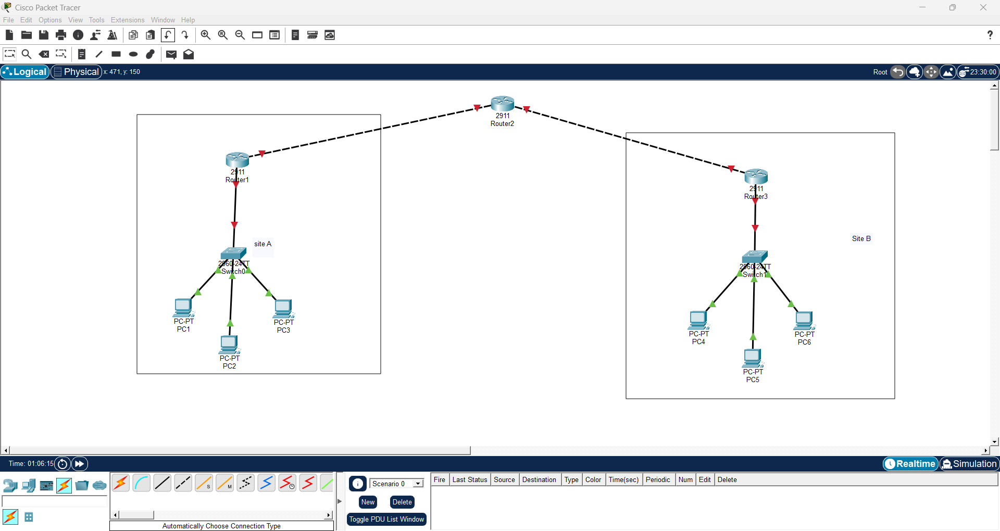  
**Figure 1 :** Topologie réseau logique globale du tunnel VPN Site-to-Site sous Cisco Packet Tracer.

### 2. Adressage IP Statique des Postes Clients
Renseignement des adresses IP statiques, masques de sous-réseau et passerelles par défaut sur l'interface Desktop de chaque PC.

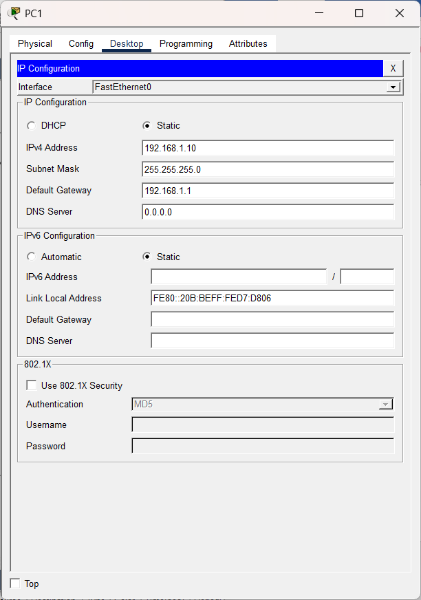  
**Figure 2 :** Configuration de l'adresse IP statique, du masque de sous-réseau et de l'adresse de passerelle sur le poste PC1.

  
**Figure 3 :** Configuration de l'adresse IP statique et des paramètres réseau locaux sur le poste PC2.

  
**Figure 4 :** Configuration réseau et adressage IP statique sur le poste PC3 (Site A).

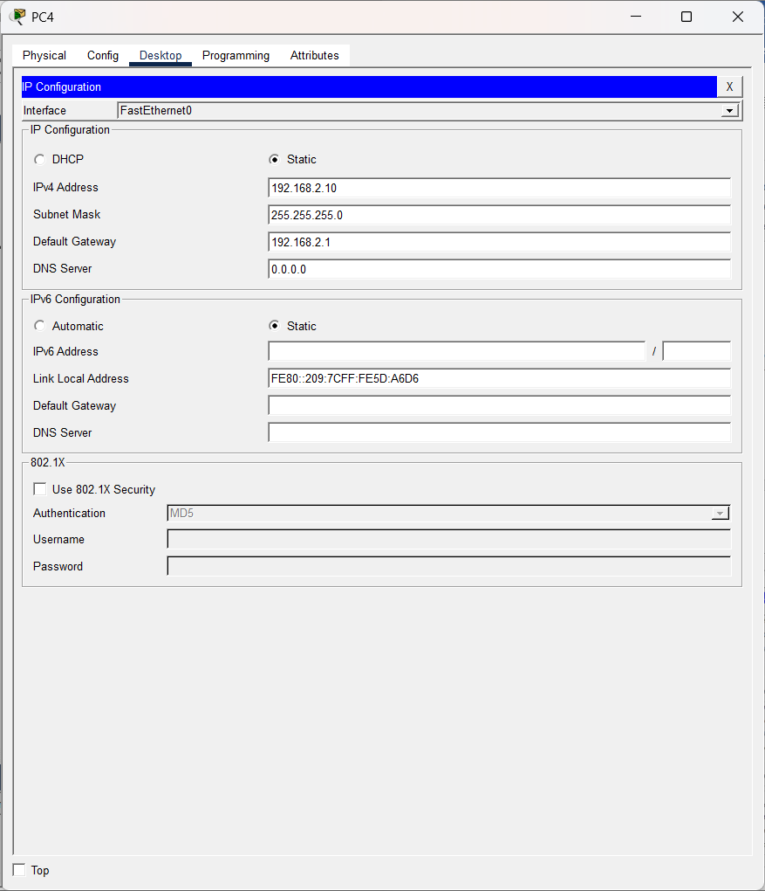  
**Figure 5 :** Configuration de l'adresse IP statique, du masque de sous-réseau et de l'adresse de passerelle sur le poste PC4 (Site B).

  
**Figure 6 :** Paramétrage de l'adresse IP statique sur la carte réseau FastEthernet du poste PC5.

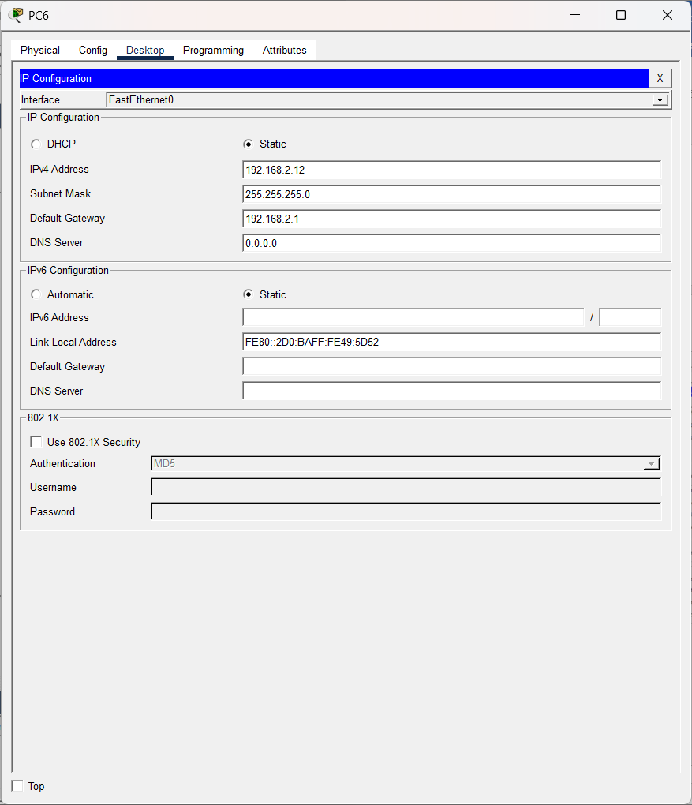  
**Figure 7 :** Configuration finale de l'adressage IP statique sur le poste de travail PC6 (Site B).

### 3. Configuration IP des Interfaces et Routage FAI
Configuration des adresses IP WAN sur GigabitEthernet0/0 et GigabitEthernet0/2 de Router 2 (FAI), et activation des interfaces.

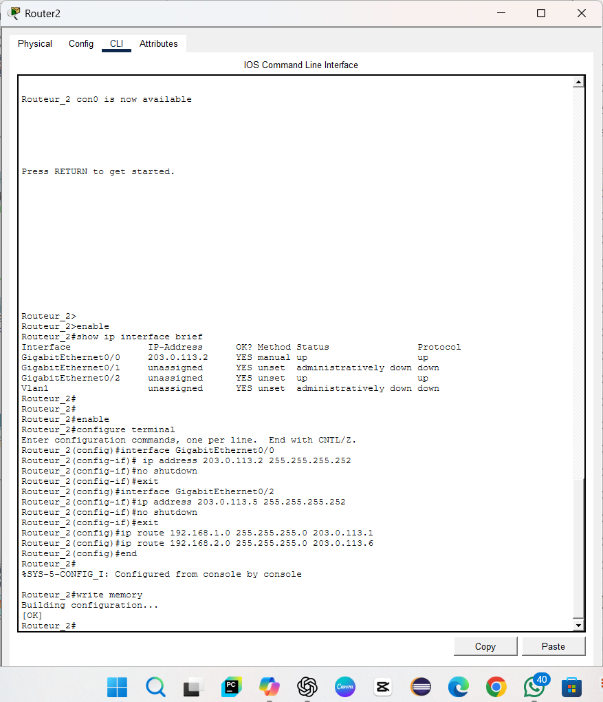  
**Figure 8 :** Configuration des adresses IP WAN et des routes de transit statiques sur le routeur central du fournisseur d'accès (Router 2).

### 4. Configuration ISAKMP (Phase I) sur le Routeur Site A
Création de la politique ISAKMP 10 (chiffrement AES, intégrité SHA, authentification par clé prépartagée) sur Router 1.

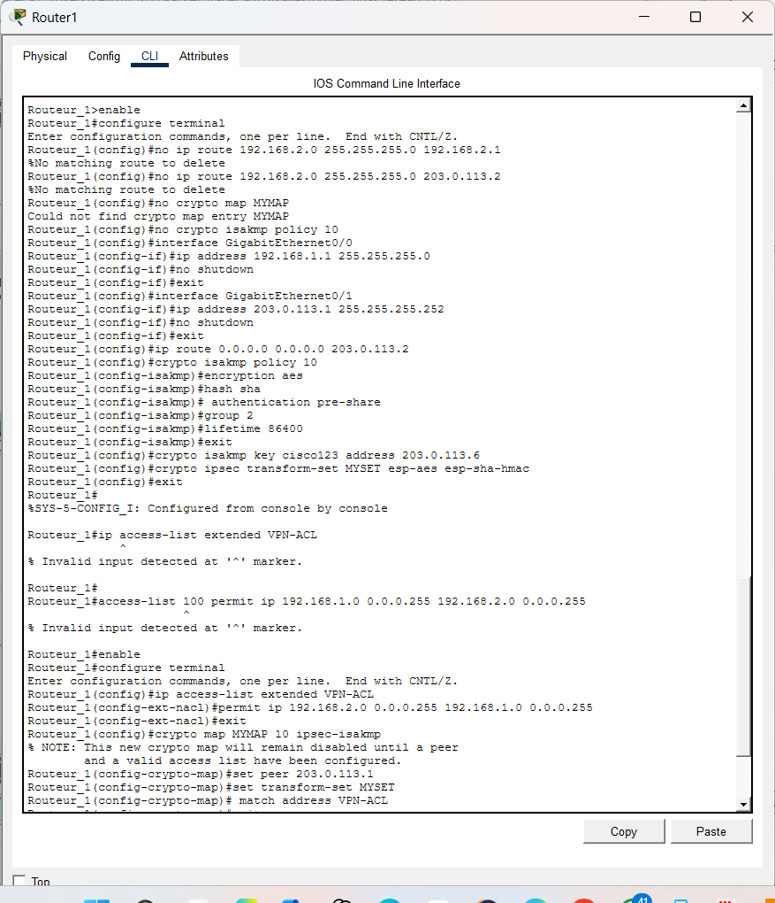  
**Figure 9 :** Initialisation des interfaces LAN/WAN et configuration initiale de la politique ISAKMP (Phase I) sur le routeur local Site A (Router 1).

Définition de la clé d'authentification pre-shared `cisc0123` liée à l'IP publique WAN du routeur distant Router 3 (203.0.113.6).

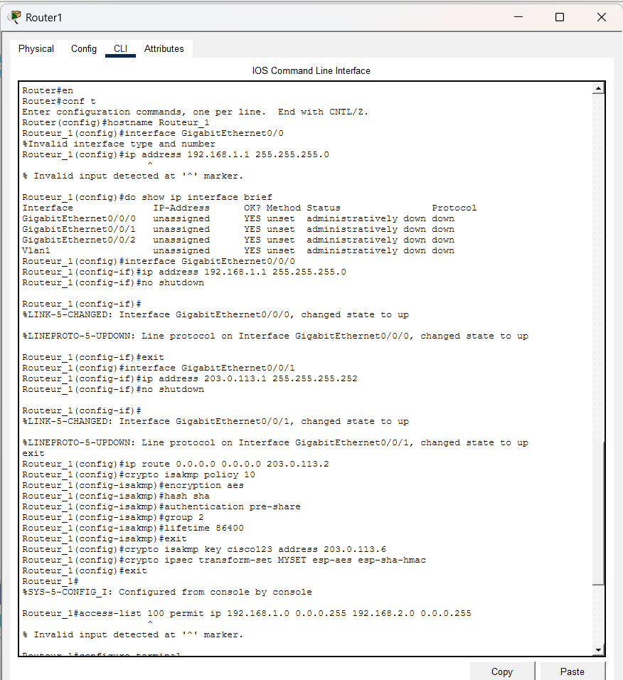  
**Figure 10 :** Définition de la politique de sécurité ISAKMP et de la clé secrète prépartagée sur le routeur principal du Site A.

### 5. Configuration IPsec (Phase II) et Crypto Map sur Router 1
Création du Transform-Set `MYSET` (esp-aes esp-sha-hmac), définition de l'ACL 100 de trafic d'intérêt, et liaison de la Crypto Map `MYMAP` à GigabitEthernet0/0/1.

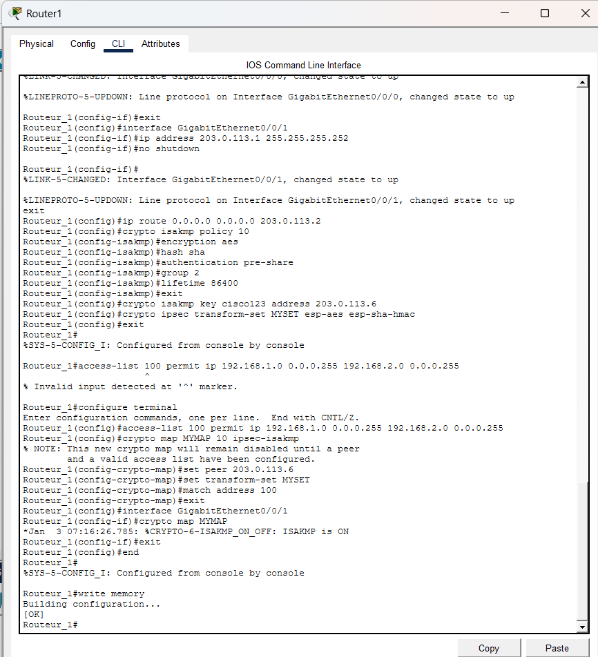  
**Figure 11 :** Déclaration de l'ACL de cryptage, du Transform-Set IPsec (Phase II) et liaison de la Crypto Map à l'interface WAN du routeur Router 1.

### 6. Configuration Miroir sur le Routeur Site B (Router 3)
Configuration symétrique sur Router 3 (interfaces, ISAKMP policy, pre-shared key pointant vers R1 (203.0.113.1), transform-set, ACL 100 inverse et Crypto Map).

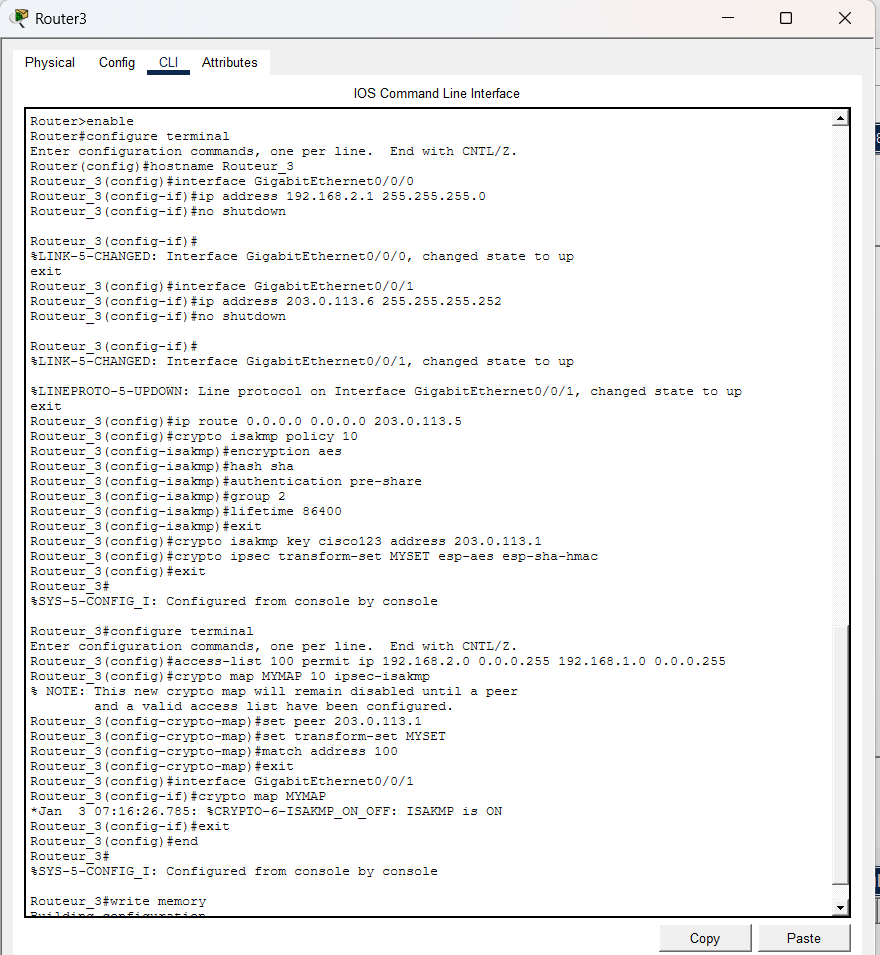  
**Figure 12 :** Configuration miroir des interfaces LAN/WAN, de la politique ISAKMP Phase I et du Transform-Set IPsec Phase II sur le routeur local Site B (Router 3).

### 7. Tests de Validation de la Connectivité Inter-Sites
Lancement de pings depuis les postes du LAN A vers le LAN B. Le premier paquet expire lors de la négociation IKE initiale, puis les paquets suivants réussissent de manière fluide.

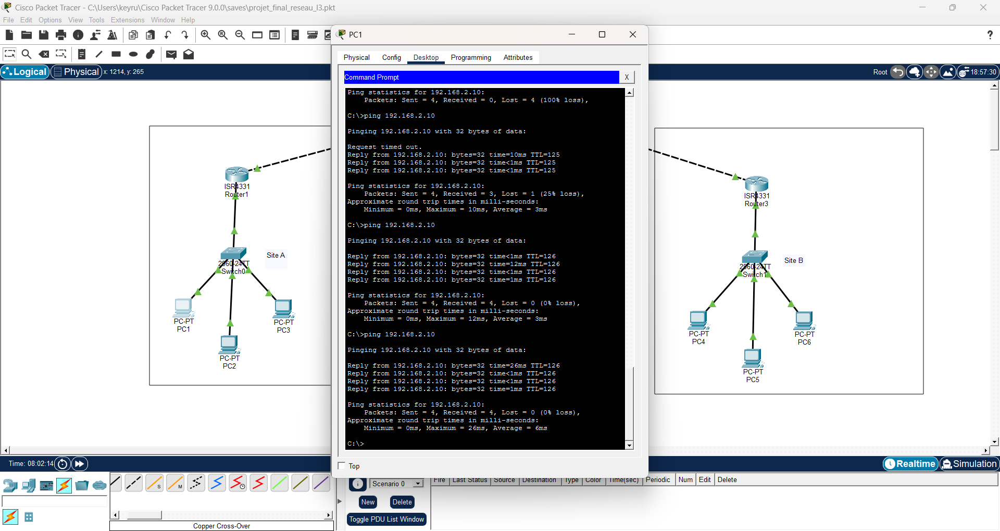  
**Figure 13 :** Test de connectivité ICMP (ping) depuis le poste PC1 (Site A) vers PC4 (Site B) montrant la réussite de la transmission à travers le tunnel.

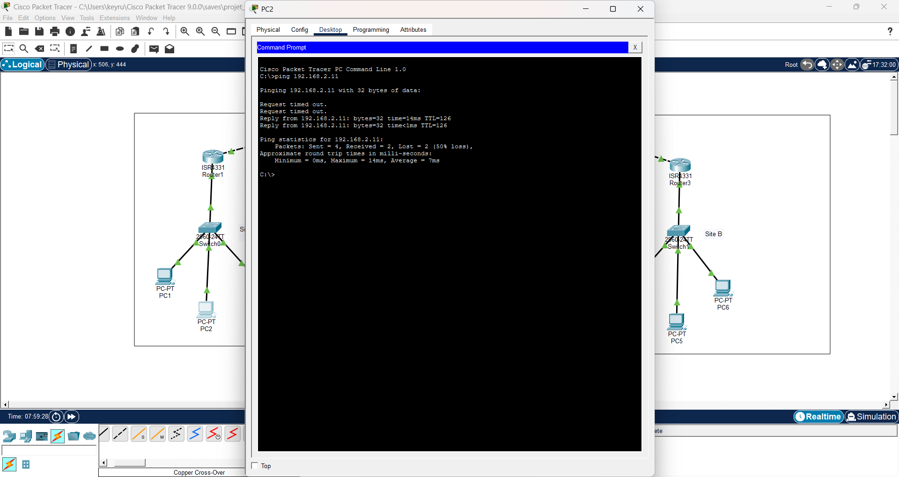  
**Figure 14 :** Validation du test de ping initié depuis le poste PC2 (Site A) vers PC5 (Site B) après établissement de la session VPN.

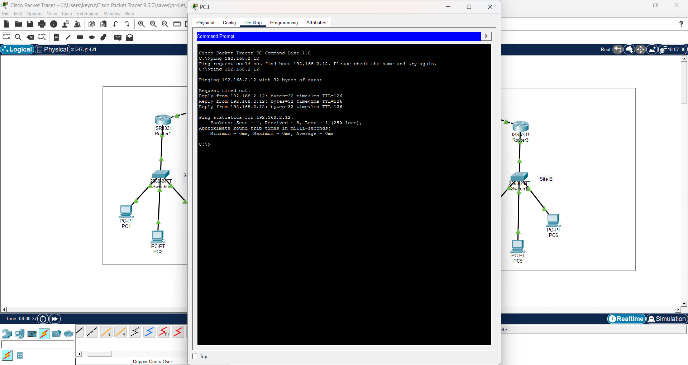  
**Figure 15 :** Succès de la connectivité réseau par ping du poste de travail PC3 (Site A) vers le poste distant PC6 (Site B).

### 8. Diagnostic Technique des Tables de Routage et du Chiffrement
Exécution de `show ip route` sur le FAI (Router 2) confirmant qu'il ne connaît pas les LAN privés, assurant l'anonymisation des flux internes.

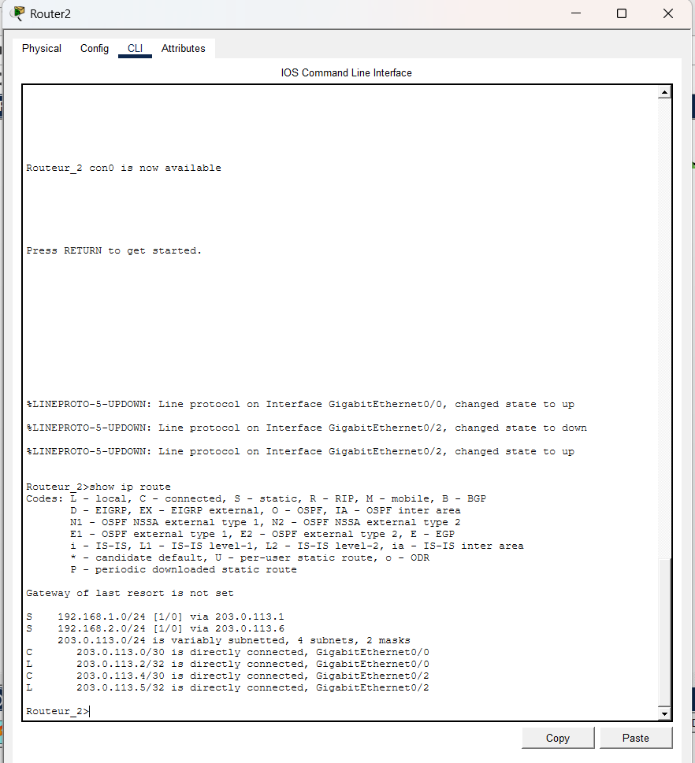  
**Figure 16 :** Table de routage dynamique et statique du routeur FAI (Router 2) confirmant l'acheminement des flux WAN publics.

Exécution de `show crypto ipsec sa` sur Router 3 validant la création de la Security Association active et l'incrémentation des paquets encapsulés/chiffrés.

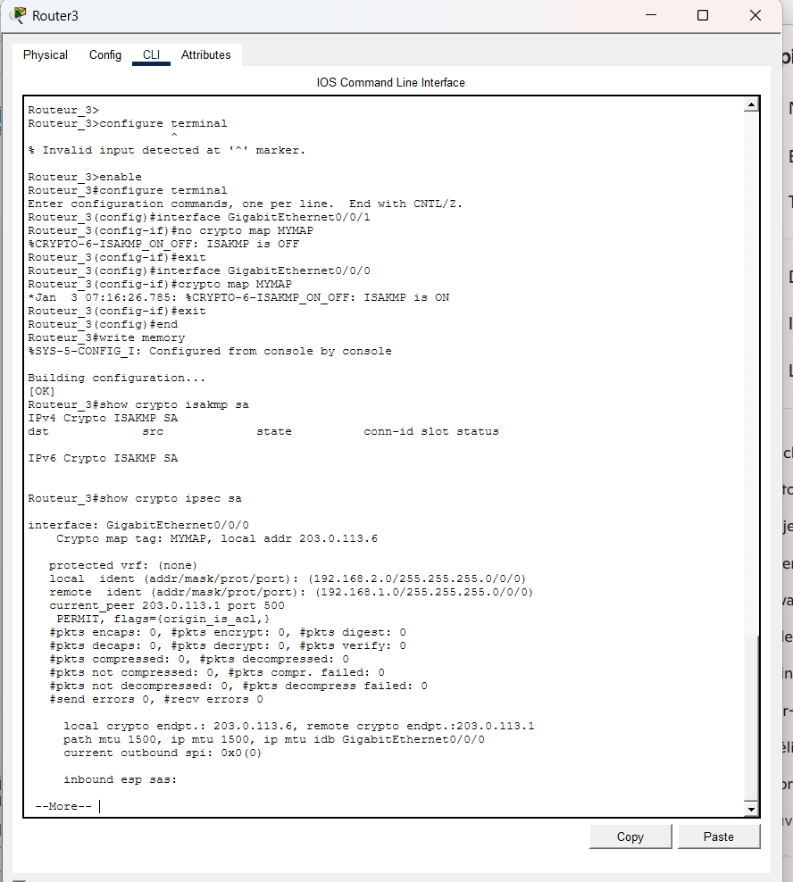  
**Figure 17 :** Commande d'inspection et de diagnostic `show crypto ipsec sa` exécutée sur le routeur distant du Site B (Router 3).

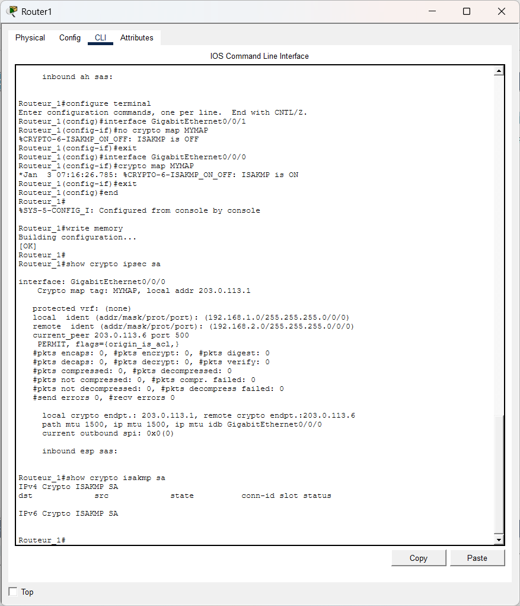  
**Figure 18 :** Commande de vérification de l'état actif des Security Associations (SA) IPsec exécutée sur le routeur local du Site A (Router 1).

Vue finale du volet d'événements montrant l'acheminement réussi et la simulation stable du réseau inter-sites.

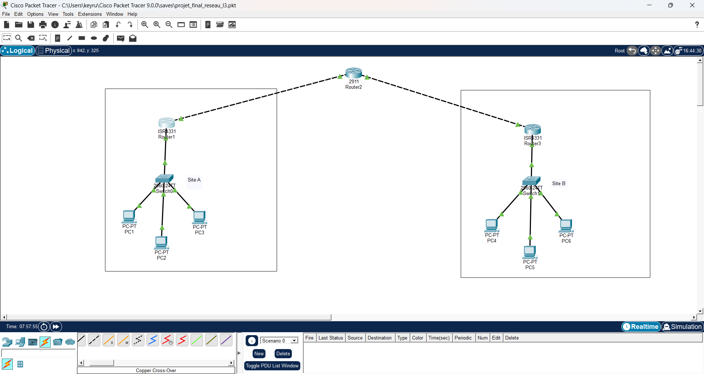  
**Figure 19 :** Statut et confirmation finale du trafic dans l'espace de simulation Cisco Packet Tracer.

---

## Résultats et analyse

Les tests de validation et de diagnostic ont donné d'excellents résultats :

*   **Connectivité totale** : Les PC communiquent à travers le WAN de manière transparente avec un temps de réponse minimal après établissement du tunnel.
*   **Chiffrement actif** : Les statistiques de la commande `show crypto ipsec sa` montrent l'incrémentation en temps réel des compteurs de chiffrement (encaps/decrypt), prouvant l'application effective de l'algorithme AES.
*   **Isolation FAI** : La table de routage du routeur Router 2 (FAI) prouve que l'opérateur n'a aucune visibilité sur les sous-réseaux privés locaux, les flux transitant de manière encapsulée sous protocole ESP.

---

## Perspectives d'évolution

Plusieurs perspectives d'évolution permettraient de perfectionner cette maquette :

*   **Migration vers IKEv2** : Négociation plus rapide, meilleure résilience aux coupures et protocole d'échange de clés optimisé.
*   **Tunnel GRE over IPsec** : Support des protocoles de routage dynamique (OSPF/EIGRP) et du trafic multicast à travers le VPN chiffré.
*   **Redondance WAN (Failover)** : Déploiement de liaisons WAN physiques doublées pour assurer une haute disponibilité en cas de panne.
*   **Pare-feu Cisco ASA** : Remplacement des routeurs frontières par des Firewalls ASA dédiés pour une inspection de niveau 7 du trafic VPN.

---

## Conclusion

Ce projet a permis de concevoir, de configurer et de valider l'interconnexion sécurisée de deux réseaux locaux distants par VPN IPsec sous Cisco Packet Tracer. En paramétrant les politiques ISAKMP et IPsec, et en validant la transmission via ping et diagnostics CLI, nous avons démontré l'efficacité et l'économie de cette architecture par rapport aux liaisons spécialisées privées physiques.

Ce travail pratique a renforcé nos compétences opérationnelles sur l'interface CLI de l'IOS Cisco et notre compréhension théorique et pratique des protocoles de chiffrement appliqués à la sécurité des réseaux d'entreprise.

---

## Bibliographie / Webographie

*   **Cisco Press** : *IPsec VPN Design - Guide officiel de conception et d'implémentation des solutions VPN*, par Vijay Bollapragada.
*   **Cisco Systems Documentation** : *Configuration Guide for Site-to-Site IPsec VPN on Cisco IOS Routers (cisco.com)*.
*   **Editions ENI** : *Réseaux Informatiques - Notions fondamentales*, par José Dordoigne.
*   **IETF RFC 2409** : *The Internet Key Exchange (IKE) - RFC spécifiant l'échange de clés Internet*.
*   **Cisco Networking Academy** : *CCNA Security - Module de formation sur la sécurisation des architectures et des tunnels IPsec*.
